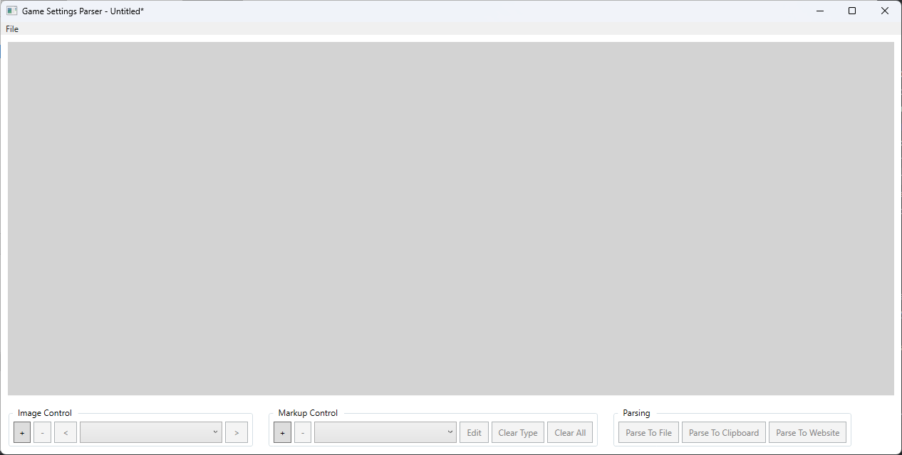
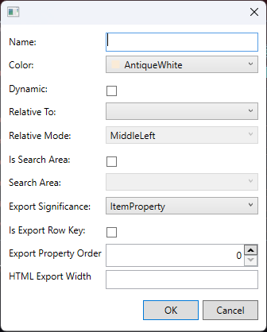
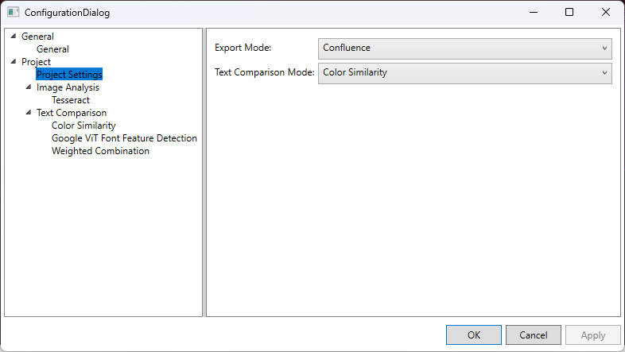
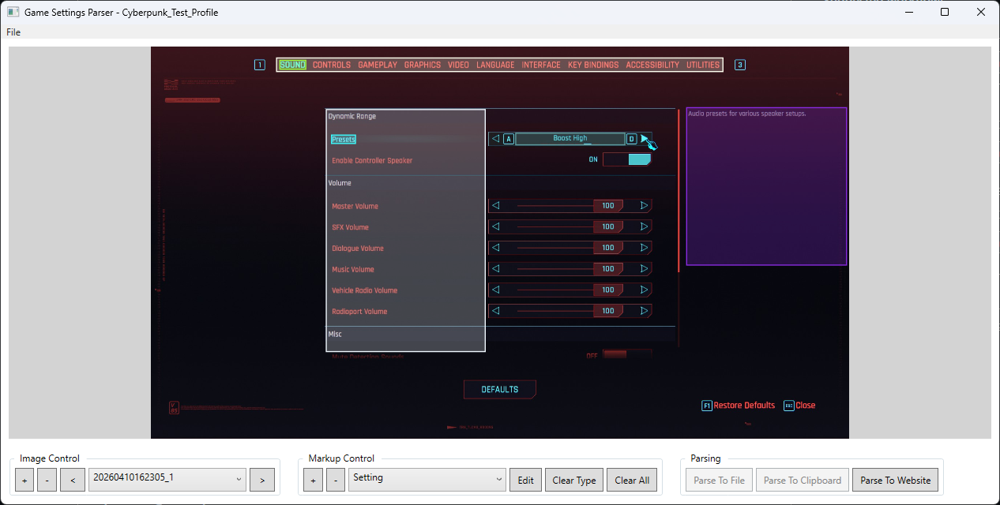

# Game Settings Parser

An application for automatically parsing screenshots of settings pages in games
and outputting in different formats for display.

Uses OCR (via Tesseract) in combination with Color Histogram and ML font feature detection to identify
and read fixed and dynamic text from images, with an editor for configuring areas of sample images 
and defining of relationships between those areas.

Currently supported output types:
* HTML
* Confluence (append/overwrite existing page only)
* Markdown
* Debug console and text file output

## Usage

When you first open the parser, you will be presented with the following view:



### Image Control
The 'Image Control' section in the bottom left can be used to add, remove and select the images
you want to use for defining the areas you want to be parsed (via Markup entries).
Simply use the `+` button to select a file on your local computer and it should subsequently appear
both in the main image area and in the dropdown image selection in the Image Control section.

### Markup Control

#### Markup Types
'Markup' entries are the key mechanism for defining what sections of an image should either be scanned
for relevant text, or used as a 'search area' for `Dynamic` elements. Add or edit a Markup entry and you
will be presented with the following dialog:



Here you can define the following attributes:

- Name
  - The name of the markup type, this name will also be used for the table header if it is marked as an `ItemProperty` in `Export Significance`
- Color
  - The color of the markup rectangles when drawn on a given `Image`
- Dynamic
  - Dynamic Markup types are those which have inconsistent placement on the screen and thus need to be searched for within each screenshot, see Dynamic Markup section below.
- Relative To
  - Only available for **Non-Dynamic** markup types, this allows you to have one markup type's position be dependent on a `Dynamic` markup type's calculated position on a given image, such as the value of the currently selected setting.
- Relative Mode
  - This defines how a markup type marked as `Relative To` another is anchored based on the training image, generally MiddleLeft or MiddleRight are most appropriate if the item is to the right or left of the dynamic area, respectively.
- Is Search Area
  - Defines this markup type as a `Search Area` for another `Dynamic` type to be searched for within. `Search Area`s will not be exported to the final output nor have text parsed themselves, they are purely a bounding area for a dynamic item.
- Search Area
  - A dropdown selection of other markup types that have been defined as a `Search Area`, this allows you to select which `Search Area` is used for a given `Dynamic` item.
- Export Significance
  - This provides a hint to the exporter as to where this data should be displayed, currently `Section` will appear above the table as the name of the table, while `ItemProperty` should be used for any element within the exported table.
- Is Export Row Key
  - This can only be selected for one Markup type and ensures it will be the first element in the exported table (this will be more significant when there are options for ordering the table output, e.g. alphabetically)
- Export Property Order
  - This defines where, relative to the Export Row Key item, the column for this Markup type's data will sit, with the lower number being closer to the left.
- HTML Export Width
  - Use this optional value to define a width in pixels for the column for this Markup type in HTML (or other similar, e.g. XHMTL) output.

#### Dynamic Markup Types

Dynamic Markup types are those which, using the `Image Analysis` and `Text Comparison` `Preferences` settings, will be automatically located and parsed
on each image processed during the Parsing process. For a given image being parsed, each potentially matching text element in the supplied,
fixed location `Search Area` markup type will be compared to each area marked with this Markup type in the Images defined in this project.

The more Images used with more examples of the dynamic area defined, the better the resulting recognition will be.

This is harder to explain than to see in action, so I recommend looking at the supplied `SampleProjects\cyberpunk_sample_project\` to understand
the process and value of setting these up.

### Drawing Markup areas

With a given Markup Type selected in the `Markup Control` dropdown selection, you can now draw directly on the Image view that takes up
the majority of the application. Simply draw a box on the Image and you can subsequently move, resize and delete (via the `Delete` key) as you wish.
Currently there isn't an easy way to 'Bring to Front' or 'Send to Back' but this functionality is planned in the future.

### Preferences

You can access both application and project specific via File -> Preferences and you should be presented with a dialog like below:



On the left you will find a tree of options areas that can be expanded or collapsed via the arrows on the left of each section.
In general these settings should be self-explanatory or provide tool tips so the majority won't be covered here.

However `Project Settings` is where you can select which `Export Mode` to use. The Parsing section of the main screen will update
with available `Parse To` options accordingly.

### Parsing

Finally, when you have set up your project appropriately, you can use one of the available `Parse To File`, `Parse To Clipboard`
or `Parse to Website` buttons in the `Parsing` section.

Upon clicking one of these buttons, you will be asked to select all the images you wish to process. Following this, the analysis
and parsing will take place, indicated by a progress bar, then depending on your chosen `Export Mode` and parsing button used, you
may be presented with a file save dialog, a confluence page dialog, or the content may now be available on your clipboard.

## Example

Included in `SampleProjects\cyberpunk_sample_project\` is an example project that uses a small number
of training images for Cyberpunk 2077's first two settings pages.
The profile uses a smaller subset of these images to define/train the markup types,
then on export will scan the whole image set if wanted.

[You can see the output of the Confluence export here.](https://billyfletcher.atlassian.net/wiki/spaces/gspe/pages/65705/Cyberpunk+2077+Example+Output)

[As well as the Markdown output here.](https://github.com/billyfletcher5000/GameSettingsParser/blob/main/SampleProjects/cyberpunk_sample_project/output/markdown_example/markdown_example.md)



## Development

### Confluence Setup ###

If you are building from source you will need to set up your own Atlassian confluence
app on the [Atlassian Developer Site](https://developer.atlassian.com/) and then set
both the correct scopes and subsequently, the relevant environment variables on your machine
(if using the default `EnvironmentVariableVaultService`).

**Required Atlassian Scopes:**

`read:content-details:confluence`
`read:page:confluence`
`write:page:confluence`
`write:attachment:confluence`
`read:space:confluence`

**Set environment variables:**

**Windows (CMD):**
   ```powershell
   setx CONFLUENCE_CLIENT_ID your-client-id
   setx CONFLUENCE_CLIENT_SECRET your-client-secret
   ```

**Linux/macOS:**
   ```bash
   export CONFLUENCE_CLIENT_ID="your-client-id"
   export CONFLUENCE_CLIENT_SECRET="your-client-secret"
   ```

## TODO

- Bring to Front/Send to Back for markup image instances
- Improve the UI/UX, it's getting there but areas need improvement, such as:
    - Inconsistency around whether it's a "Project" or a "Profile"
    - Export selection could be streamlined
    - Rules of markup types could be more apparent/intuitive
    - Main screen lacks a particularly logical/intuitive layout
- Add more/custom text comparison services, current ML font feature detection underperforms somewhat, only color similarity seems reliable.
- Further/better documentation/usage guide