# Game Settings - Cyberpunk_Test_Profile

## SOUND

|Setting|Value(s)|Description|Screenshots|
|----|----|----|----|
|Presets|Headphones, TV Speakers, Small Speakers, Boost Low, Boost High ©, 3D Headphones —|Audio presets for various speaker setups.|[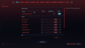](./screenshots/sound/20260410162254_1.jpg)[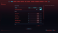](./screenshots/sound/20260410162300_1.jpg)[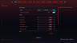](./screenshots/sound/20260410162303_1.jpg)[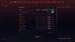](./screenshots/sound/20260410162306_1.jpg)|
|Enable Controller Speaker||Enable Controller Speaker|[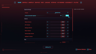](./screenshots/sound/20260410162310_1.jpg)|
|Master Volume|100 J|The general volume of all sounds in the game.|[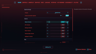](./screenshots/sound/20260410162312_1.jpg)|
|SFX Volume|oom)|The volume of special effects in the game.|[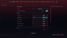](./screenshots/sound/20260410162313_1.jpg)|
|Mute Detection Sounds||Mutes the sound that occurs when the player is detected by enemies.|[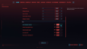](./screenshots/sound/20260410162322_1.jpg)|
|Disable Copyrighted Music||Disables copyrighted music that occurs in game.|[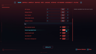](./screenshots/sound/20260410162323_1.jpg)|
|Disable Spatial Audio||Disables spatial audio. (Requires Game Restart)|[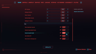](./screenshots/sound/20260410162324_1.jpg)|
|Misc|||[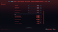](./screenshots/sound/20260410162324_2.jpg)|
|Mute Game in Background||Mutes game audio when the game window is running in the background.|[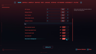](./screenshots/sound/20260410162325_1.jpg)|

## CONTROLS

|Setting|Value(s)|Description|Screenshots|
|----|----|----|----|
|Tutorials||Enables hints in the menu and during gameplay.|[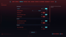](./screenshots/controls/20260410162329_1.jpg)|
|Skipping Diclogues|By Line|Select your preferred Skip Dialogue mode, "By Line” will skip only one line at a time. "Continuous" will skip all lines for as long as you hold the button.|[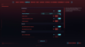](./screenshots/controls/20260410162330_1.jpg)|
|Enable cross-platform Saves||Enables access to cross-platform saved games for automatic upload and sync.|[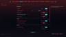](./screenshots/controls/20260410162332_1.jpg)|
